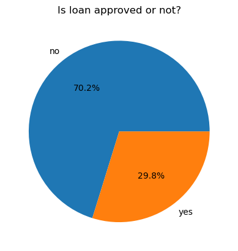
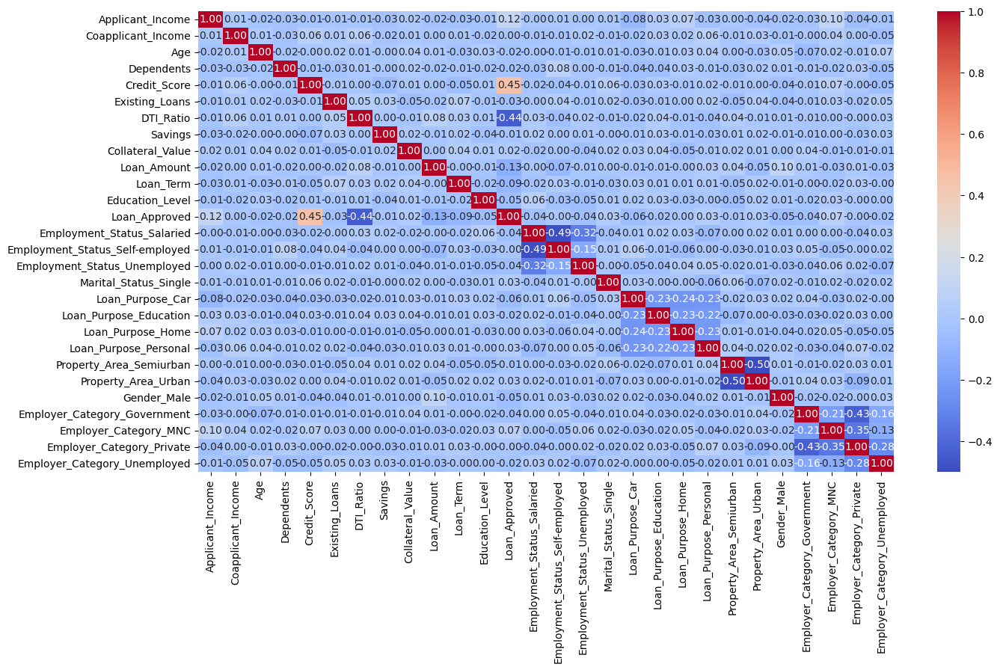
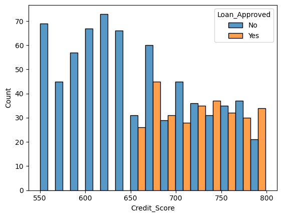

# CreditWise — Loan Approval Prediction Using Classification Models

An end-to-end machine learning project that predicts whether a loan application will be **approved or rejected**, based on applicant financial, demographic, and loan-specific data. The pipeline combines data cleaning, exploratory data analysis, feature encoding, and comparison of three classification algorithms (Logistic Regression, KNN, Gaussian Naive Bayes), followed by feature engineering to improve performance.

---

## 🔍 Project Overview

CreditWise analyzes **1,000 loan applications** and predicts the binary target `Loan_Approved` (Yes/No) using applicant income, credit score, debt-to-income ratio, collateral, and demographic attributes. The goal is to help a lender flag likely-approved vs. likely-rejected applications early, and to compare which model gives the most reliable predictions for that decision.

The notebook walks through the full supervised learning workflow:

`Raw data → Missing Value Imputation → EDA → Encoding → Correlation Analysis → Train/Test Split & Scaling → Baseline Modeling → Feature Engineering → Re-evaluation`

---

## 💼 Business Problem

Manually underwriting every loan application is slow and inconsistent across reviewers. A predictive model helps a lender:

- Flag high-risk applications for closer manual review
- Speed up approval turnaround for clearly low-risk applicants
- Standardize decisions using measurable financial signals (income, DTI ratio, credit score) instead of reviewer judgment alone
- Understand which applicant/loan attributes most influence approval, to refine lending criteria

---

## 📊 Dataset

**File:** `loan_data.csv` (1,000 rows × 19 columns after dropping identifier columns)

| Category | Columns | Description |
|---|---|---|
| **Applicant financials** | `Applicant_Income`, `Coapplicant_Income`, `Savings`, `Credit_Score`, `DTI_Ratio`, `Existing_Loans` | Income, savings, creditworthiness, and existing debt load |
| **Loan details** | `Loan_Amount`, `Loan_Term`, `Loan_Purpose`, `Collateral_Value` | What's being borrowed and against what |
| **Demographics** | `Age`, `Gender`, `Marital_Status`, `Dependents`, `Education_Level`, `Employment_Status`, `Employer_Category` | Applicant profile |
| **Location** | `Property_Area` | Urban / Semiurban / Rural |
| **Target** | `Loan_Approved` | Yes / No |

Dropped columns: `Unnamed: 0`, `Applicant_ID` (non-predictive identifiers). The raw data contains missing values across both numeric and categorical fields.

---

## 📁 Repository Structure

```
.
├── images/                                    # EDA & analysis plots (referenced in this README)
├── creditwise_loan-prediction-system.ipynb   # Main analysis notebook (cleaning → modeling)
├── loan_data.csv                             # Raw applicant dataset (1,000 rows)
├── .gitignore
├── LICENSE
├── README.md                                 # Project documentation (this file)
└── requirements.txt                          # Python dependencies
```

---

## 🛠️ Requirements

- Python 3.8+
- Jupyter Notebook or JupyterLab

**Python packages:**

| Package | Purpose |
|---|---|
| `pandas` | Data loading and manipulation |
| `numpy` | Numerical operations (log transform, squared features) |
| `matplotlib` | Plotting |
| `seaborn` | Statistical visualization (histograms, box plots) |
| `scikit-learn` | Imputation, encoding, scaling, classification models, metrics |

---

## ⚙️ Installation

```bash
# Clone the repository
git clone https://github.com/<your-username>/creditwise-loan-prediction.git
cd creditwise-loan-prediction

# (Optional) create a virtual environment
python -m venv venv
source venv/bin/activate      # On Windows: venv\Scripts\activate

# Install dependencies
pip install -r requirements.txt
```

---

## 🧠 Methodology

### 1. Data Cleaning
- Dropped identifier columns (`Unnamed: 0`, `Applicant_ID`)
- Imputed missing **numeric** values with the column **mean** (`SimpleImputer(strategy="mean")`)
- Imputed missing **categorical** values with the **most frequent** category (`SimpleImputer(strategy="most_frequent")`)

### 2. Exploratory Data Analysis
- Checked class balance of the target (`Loan_Approved`)
- Distribution analysis across categorical fields
- Income distribution (histogram)
- Outlier detection via box plots across numeric features (2×3 subplot grid)
- Credit Score vs. Loan Approval relationship

<p align="center">
  
  
</p>
<p align="center">
  
  
</p>

*Full set of plots (categorical breakdowns, outlier box plots, credit score distribution) available in `images/`.*


### 3. Feature Encoding
- `LabelEncoder` for `Education_Level` and the target `Loan_Approved`
- `OneHotEncoder(drop="first")` for nominal categoricals: `Employment_Status`, `Marital_Status`, `Loan_Purpose`, `Property_Area`, `Gender`, `Employer_Category`
- Final encoded dataset: **28 numeric columns**

### 4. Correlation Analysis
- Computed a correlation matrix of numeric features against `Loan_Approved` to identify the strongest linear predictors before modeling

### 5. Train/Test Split & Scaling
- 80/20 split (`train_test_split`, `random_state=42`) → 800 train / 200 test rows
- `StandardScaler` applied to all features (fit on train, transformed on test) — required since KNN and Logistic Regression are scale-sensitive

### 6. Baseline Modeling
Three classifiers trained on the scaled, encoded feature set:
- Logistic Regression
- K-Nearest Neighbors (k = 5)
- Gaussian Naive Bayes

### 7. Feature Engineering
Added three engineered features and re-ran all three models:

| New Feature | Derived From | Logic |
|---|---|---|
| `DTI_Ratio_sq` | `DTI_Ratio` | Squared, to capture non-linear risk at high debt ratios |
| `Credit_Score_sq` | `Credit_Score` | Squared, to emphasize separation at score extremes |
| `Applicant_Income_log` | `Applicant_Income` | Log-transformed (`log1p`) to reduce income right-skew |

Original `DTI_Ratio` and `Credit_Score` columns were dropped in favor of their transformed versions.

---

## 📈 Results

**Baseline (before feature engineering)**

| Model | Precision | Accuracy | Recall | F1 |
|---|---|---|---|---|
| Logistic Regression | 78.33% | 86.5% | 77.05% | 77.69% |
| K-Nearest Neighbors (k=5) | 62.75% | 76.0% | 52.46% | 57.14% |
| Gaussian Naive Bayes | **80.36%** | 86.5% | 73.77% | 76.92% |

**After feature engineering**

| Model | Precision | Accuracy | Recall | F1 |
|---|---|---|---|---|
| Logistic Regression | 78.46% | **88.0%** | **83.61%** | **80.95%** |
| K-Nearest Neighbors (k=5) | 67.31% | 78.5% | 57.38% | 61.95% |
| Gaussian Naive Bayes | **81.13%** | 86.0% | 70.49% | 75.44% |

**Interpretation:**
- **Gaussian Naive Bayes** had the highest **precision** in both rounds — the fewest false approvals — which the notebook flags as the priority metric (*"Best model on the basis of precision → Naive Bayes"*).
- **Logistic Regression** improved the most from feature engineering: accuracy rose 86.5% → 88.0% and recall jumped 77.1% → 83.6%, making it the best model by **accuracy and F1** after engineering.
- **KNN consistently underperformed** both other models across both rounds, even with engineered features — likely more sensitive to the mixed categorical/numeric feature space.

> Which model is "best" depends on the lender's priority: minimize false approvals (Naive Bayes) vs. maximize overall correct decisions (Logistic Regression).

---

## ▶️ Usage

```bash
jupyter notebook creditwise_loan-prediction-system.ipynb
```

Run all cells sequentially (`Kernel → Restart & Run All`). Ensure `loan_data.csv` sits in the same directory as the notebook, or update the file path in the `pd.read_csv(...)` call at the top.

---

## 🔮 Future Improvements

- Add cross-validation instead of a single train/test split for more robust metric estimates
- Try tree-based models (Random Forest, Gradient Boosting/XGBoost) as stronger baselines
- Address class imbalance explicitly (class weighting or SMOTE) if approval classes are skewed
- Hyperparameter tuning (grid/random search) for KNN's `k` and Logistic Regression's regularization strength
- Add SHAP or permutation feature importance to explain individual predictions — important for a lending use case
- Package the best model behind a simple API (FastAPI/Flask) for real-time scoring

---

## 📄 License

This project is currently unlicensed. Consider adding an [MIT License](https://choosealicense.com/licenses/mit/) or similar if you plan to share or accept contributions publicly.
